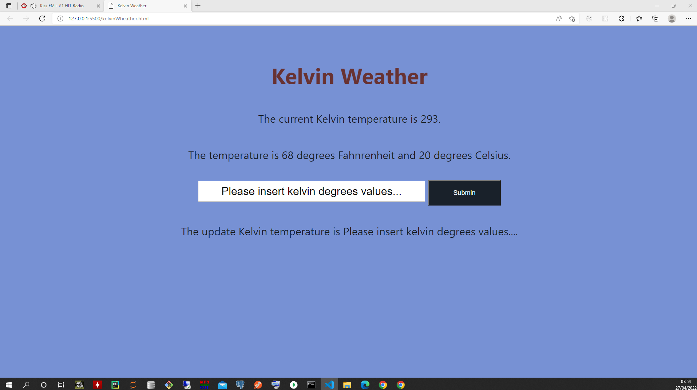

# kerlvin-wheather-js Html/Css/Javascript

Temperature degrees converter from Fahrenheit and Celcius to Kelvin.
=====================

Future implementation will follow to take user input and update kelvin variable.
---------------------------------------------------

[AboutMe](https://github.com/rex28/About-Me)

---------------------------------------------------

